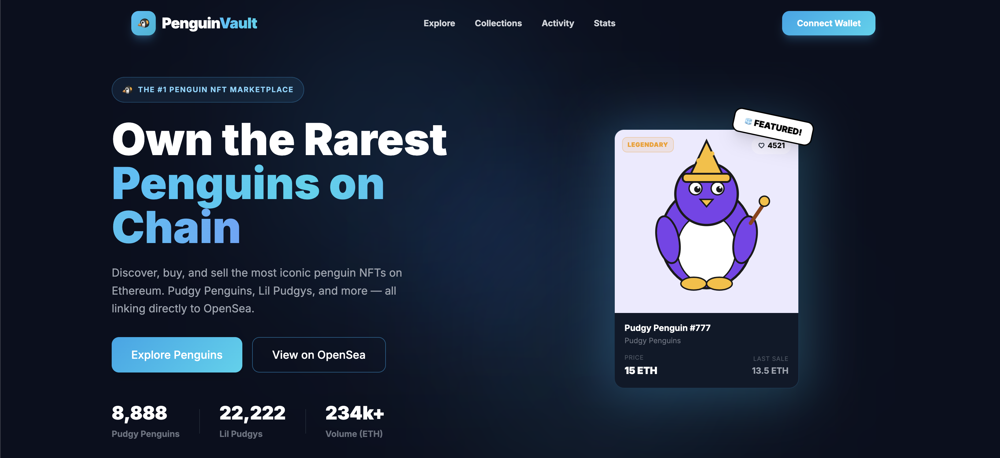

<p align="center">
  
</p>

# 🐧 Penguin NFT Marketplace

> **A premium NFT aggregator for cartoon enthusiasts, powered by the OpenSea Seaport protocol.**

---

## 🚀 Project Overview
**Penguin NFT Marketplace** is a specialized platform designed for discovering and trading cartoon-themed digital assets. By integrating the **OpenSea API**, the platform provides a high-performance, niche UI while leveraging the world's most secure liquidity layer for transaction fulfillment.

### Why this architecture?
As a Senior Developer, I chose the **Aggregator Model** to prioritize:
* **Security:** Utilizing OpenSea's audited smart contracts for all financial settlements.
* **Liquidity:** Ensuring users' assets are visible on global markets instantly.
* **Performance:** A custom-built frontend optimized for high-res cartoon metadata.

---

## ✨ Key Features

* **🦊 Web3 Wallet Integration:** Full support for MetaMask and Coinbase Wallet.
* **🔄 Live OpenSea Sync:** Real-time floor prices, traits, and listing status via REST API.
* **🎨 Themed Discovery:** Custom UI components built specifically for character-based NFT collections.
* **🛡️ Secure Redirection:** Direct routing to OpenSea asset pages for "Buy/Sell" execution to prevent phishing and contract risks.
* **⚡ Multi-Chain Support:** Seamlessly browse assets across Ethereum, Polygon, and Arbitrum.

---

## 🛠️ Technical Stack

| Layer | Technology |
| :--- | :--- |
| **Frontend** | React.js + Vite |
| **Styling** | Tailwind CSS + Framer Motion |
| **Web3** | Ethers.js / Wagmi |
| **Backend** | Node.js (OpenSea SDK) |
| **Data** | OpenSea API v2 |

---

## 📖 How It Works

1.  **Connect:** User authenticates via their private Web3 wallet.
2.  **Fetch:** The system queries the OpenSea API for specific "Cartoon" verified collections.
3.  **Explore:** Users interact with a custom-themed gallery featuring real-world market data.
4.  **Transact:** Clicking "Buy" generates a secure link to the official OpenSea listing for on-chain fulfillment.

---

## 🏁 Installation & Setup

### Prerequisites
* Node.js v18 or higher
* pnpm (recommended) or npm

### Steps
```bash
# Clone the repository
git clone https://github.com/maleeha045/penguin-marketplace.git

# Install dependencies
pnpm install

# Set up environment variables (.env)
VITE_OPENSEA_API_KEY=your_key_here

# Start development server
pnpm run dev
